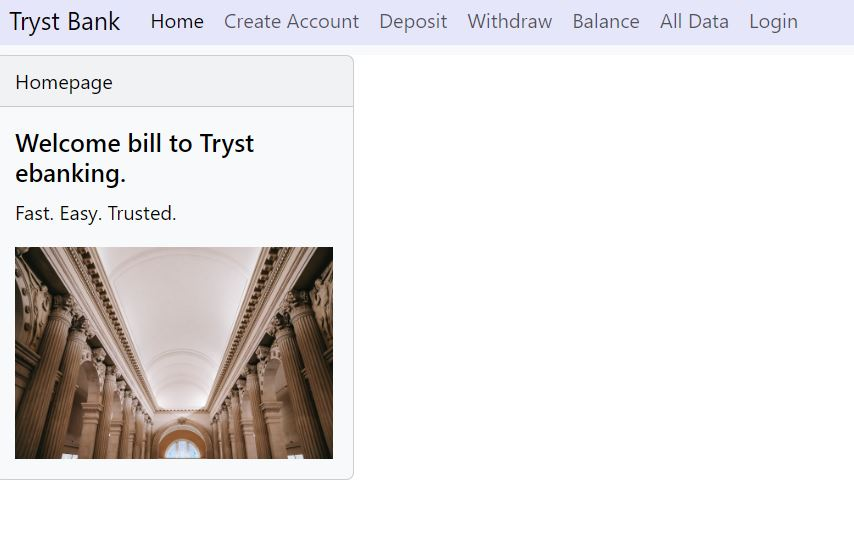

# Tryst Bank
Simulates the functionality of a basic bank application. 
### Details
This was the final MITxPro course project. It allows the given account user to deposit, withdraw, and display their balance.
### Potential Improvements
I would like to include a function that models a mortgage loan base on user input to show payments, amortization etc.
### How to Run
[click here](https://notarealbank.s3.amazonaws.com/index.html#/)

[Home](https://taylorcharleshall.github.io)
